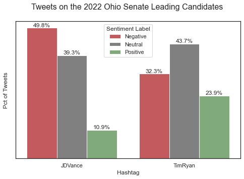

# 2022 Ohio Senate Elections Sentiment Analysis

The 2022 midterm Elections are scheduled to be held tomorrow and thought it was a good time to understand the public mood and opinion towards the Ohio senate leading candidates. 

For this analysis, I have collected tweets made since Jan 2022 using Snscrape to scrape tweets from Twitter and performed sentiment classification model (Twitter-roBERTa-base) trained by HuggingFace.

snscrape to pull tweets
Github Repo: https://github.com/JustAnotherArchivist/snscrape

Twitter-roBERTa-base for Sentiment Analysis - UPDATED (2021)
This is a roBERTa-base model trained on ~124M tweets from January 2018 to December 2021, and finetuned for sentiment analysis with the TweetEval benchmark
https://huggingface.co/cardiffnlp/twitter-roberta-base-sentiment-latest?text=Covid+cases+are+increasing+fast%21

